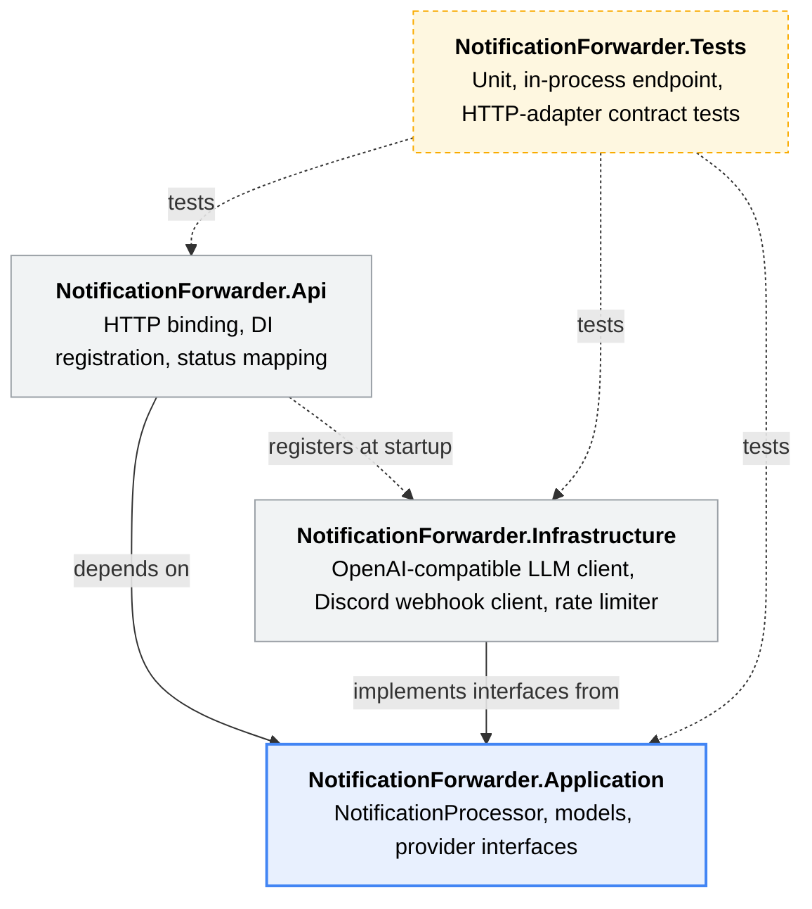
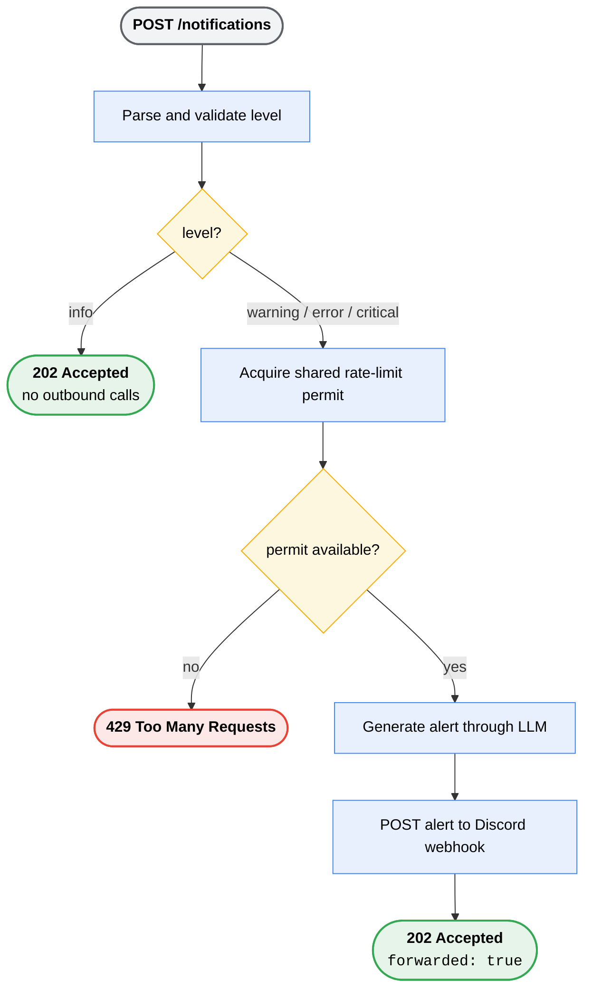

# Notification Application
## Project Overview
Send notifications to Discord channels when attention is needed.
**/technology**: .NET 10 minimal API, OpenAI-compatible Responses API, Discord incoming webhooks, xUnit, WireMock/Testcontainers.

# What the service does
The service exposes a REST API Endpoint  for operational events

| Notification level | Behavior |
| --- | --- |
| `info` | Accept the event and stop. No external request occurs. |
| `warning`, `error`, `critical` | Generate an actionable plain-text alert, then send it to Discord. |
| Unknown level | Reject the request with validation details. |

The request succeeds only after the LLM and Discord delivery succeed. 

# API Specification
The implementation prioritizes a small, testable path

1. HTTP concerns in the API layer.
2. Notification rules and provider contracts in a provider-agnostic Application layer.
3. Third-party provider implementations in a separate Infrastructure layer.
4. Test the rules and provider contracts independently from real third parties.

This structure allows for a clean separation of concerns and makes it easier to test.

# Solution structure:


`Application` depends on no other project, the API chooses the concrete adapters at startup, and the tests can be run in isolation from any third-party service.

# Request Life Cycle


The ASP.NET cancellation token travels through both outbound calls, so a cancelled request can stop pending work.

# Key decisions and rationale

| Decision | Why it was made | Consequence to understand |
| --- | --- | --- |
| Synchronous forwarding | The API gives the caller a definitive delivery result. | LLM and Discord latency appear in the request time. |
| Ignore `info` events | Routine events do not need escalation or consume provider capacity. | Callers still receive `202 Accepted`. |
| LLM-generated plain text | Raw event details become a concise alert with impact and a next step. | Model output affects the alert wording. |
| OpenAI-compatible endpoint | The default supports OpenAI and configuration can point to Ollama. | Provider choice stays in configuration. |
| In-memory sliding-window limit | Limits burst pressure without adding infrastructure. | Each deployed instance has its own quota. |

# HTTP contract and error mapping

`POST /notifications` accepts:

```json
{
  "level": "warning",
  "title": "Disk space is low",
  "message": "Only 5% remains on /var/lib/data.",
  "source": "database-01",
  "occurredAt": "2026-08-26T10:00:00Z"
}
```

| Condition | HTTP result |
| --- | --- |
| Valid informational notification | `202 Accepted` |
| Successful escalation delivery | `202 Accepted` with `forwarded: true` |
| Unknown severity | `400 Bad Request` with validation details |
| More than 10 escalation attempts in a rolling minute | `429 Too Many Requests` |
| Missing dependency configuration | `503 Service Unavailable` |
| LLM or Discord request failure | `502 Bad Gateway` |

`GET /health` returns `200 OK` with `{ "status": "ok" }`.

# Rate limiting behaviour

`OutboundRateLimiter` is a singleton built on .NET's `SlidingWindowRateLimiter`.

- Permit limit: 10 escalation notifications per rolling minute.
- Window segmentation: six segments.
- Queue: none. The eleventh request receives `429` immediately.
- Scope: one service process.
- Timing: the permit is acquired before either external call.

A failed LLM or Discord call still consumes a permit.


# LLM and Discord integration

The LLM adapter posts to the configured OpenAI-compatible Responses endpoint. It supplies the source event as input and asks for a factual, actionable Discord message that remains below 1,500 characters.

The code also truncates the returned text to 1,500 characters, leaving headroom under Discord's 2,000-character message limit.

The Discord adapter posts this shape to the configured incoming-webhook URL:

```json
{ "content": "LLM-generated alert text" }
```

Both typed `HttpClient` registrations use a 30-second timeout.

# Configuration and security

Configuration keys:

| Key | Role |
| --- | --- |
| `Llm:Endpoint` | OpenAI-compatible Responses endpoint |
| `Llm:ApiKey` | Optional bearer token; blank works for local Ollama |
| `Llm:Model` | Model submitted to the endpoint |
| `Discord:WebhookUrl` | Incoming Discord webhook, including its secret token |

Use user secrets, environment variables, or a deployment secret store. Environment variables use double underscores, for example `Llm__ApiKey`.
 
# Test coverage

The test suite layers confidence from core rules to real HTTP request shapes.

| Test level | What it covers |
| --- | --- |
| Unit tests | Severity routing, invalid levels, rate-limit behaviour, and dependency-call ordering. |
| In-process API tests | Endpoint binding and HTTP mapping for success, validation, configuration, provider failure, and rate-limit responses. |
| WireMock container tests | The real OpenAI-compatible and Discord adapters against disposable HTTP endpoints. |

# Local operation

Configure secrets outside the repository, then run:

```bash
dotnet run --project NotificationForwarder.Api
```

Send a smoke-test event to the URL ASP.NET Core prints:

```bash
curl -X POST http://localhost:5000/notifications \
  -H 'content-type: application/json' \
  -d '{"level":"warning","title":"Disk space","message":"Only 5% remains","source":"database"}'
```